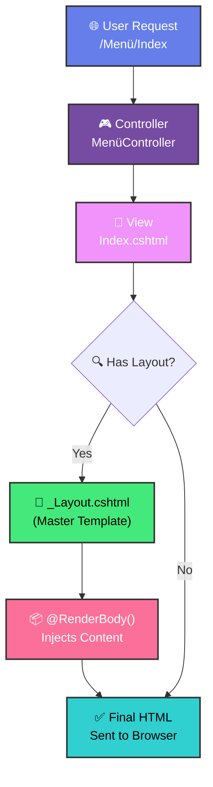

<div align="center">

<!-- Animated Header Banner -->


<!-- Animated Typing SVG -->


<br/>

<!-- Tech Badges -->


<br/><br/>

<!-- Animated Divider -->


</div>

## 🎯 Proje Hakkında

Bu proje **ASP.NET MVC Layout sistemini öğrenmek** için geliştirilmiş modern bir restoran menü uygulamasıdır. Layout'un nasıl çalıştığını ve neden önemli olduğunu anlamak için pratik bir örnek sunar.

### 🎯 Key Learning: ASP.NET MVC Layout System

<div align="center">

<!-- Animated Alert Box -->


<br/><br/>

<!-- Animated Layout Diagram with Colors -->
<table>
<tr>
<td>



</td>
</tr>
</table>

<br/>

<!-- ASCII Art with Animation Effect -->
<img src="https://readme-typing-svg.demolab.com?font=Fira+Code&size=16&duration=1500&pause=3000&color=667EEA&center=true&vCenter=true&multiline=true&width=700&height=280&lines=%E2%94%8C%E2%94%80%E2%94%80%E2%94%80%E2%94%80%E2%94%80%E2%94%80%E2%94%80%E2%94%80%E2%94%80%E2%94%80%E2%94%80%E2%94%80%E2%94%80%E2%94%80%E2%94%80%E2%94%80%E2%94%80%E2%94%80%E2%94%80%E2%94%80%E2%94%80%E2%94%80%E2%94%80%E2%94%80%E2%94%80%E2%94%80%E2%94%80%E2%94%80%E2%94%80%E2%94%80%E2%94%80%E2%94%80%E2%94%80%E2%94%80%E2%94%80%E2%94%80%E2%94%80%E2%94%80%E2%94%80%E2%94%80%E2%94%80%E2%94%80%E2%94%80%E2%94%80%E2%94%80%E2%94%80%E2%94%80%E2%94%80%E2%94%80%E2%94%80%E2%94%80%E2%94%80%E2%94%80%E2%94%80%E2%94%80%E2%94%90;%E2%94%82+%F0%9F%8E%A8+_Layout.cshtml+(Master+Template)+%E2%94%82;%E2%94%82+%E2%94%8C%E2%94%80%E2%94%80%E2%94%80%E2%94%80%E2%94%80%E2%94%80%E2%94%80%E2%94%80%E2%94%80%E2%94%80%E2%94%80%E2%94%80%E2%94%80%E2%94%80%E2%94%80%E2%94%80%E2%94%80%E2%94%80%E2%94%80%E2%94%80%E2%94%80%E2%94%80%E2%94%80%E2%94%80%E2%94%80%E2%94%80%E2%94%80%E2%94%80%E2%94%80%E2%94%80%E2%94%80%E2%94%80%E2%94%80%E2%94%80%E2%94%80%E2%94%80%E2%94%80%E2%94%80%E2%94%80%E2%94%80%E2%94%80%E2%94%80%E2%94%80%E2%94%80%E2%94%80%E2%94%80%E2%94%80%E2%94%80%E2%94%90+%E2%94%82;%E2%94%82+%E2%94%82+%F0%9F%93%8B+Header+%2F+Navigation+%E2%94%82+%E2%94%82;%E2%94%82+%E2%94%94%E2%94%80%E2%94%80%E2%94%80%E2%94%80%E2%94%80%E2%94%80%E2%94%80%E2%94%80%E2%94%80%E2%94%80%E2%94%80%E2%94%80%E2%94%80%E2%94%80%E2%94%80%E2%94%80%E2%94%80%E2%94%80%E2%94%80%E2%94%80%E2%94%80%E2%94%80%E2%94%80%E2%94%80%E2%94%80%E2%94%80%E2%94%80%E2%94%80%E2%94%80%E2%94%80%E2%94%80%E2%94%80%E2%94%80%E2%94%80%E2%94%80%E2%94%80%E2%94%80%E2%94%80%E2%94%80%E2%94%80%E2%94%80%E2%94%80%E2%94%80%E2%94%80%E2%94%80%E2%94%80%E2%94%80%E2%94%80%E2%94%98+%E2%94%82;%E2%94%82+%E2%94%8C%E2%94%80%E2%94%80%E2%94%80%E2%94%80%E2%94%80%E2%94%80%E2%94%80%E2%94%80%E2%94%80%E2%94%80%E2%94%80%E2%94%80%E2%94%80%E2%94%80%E2%94%80%E2%94%80%E2%94%80%E2%94%80%E2%94%80%E2%94%80%E2%94%80%E2%94%80%E2%94%80%E2%94%80%E2%94%80%E2%94%80%E2%94%80%E2%94%80%E2%94%80%E2%94%80%E2%94%80%E2%94%80%E2%94%80%E2%94%80%E2%94%80%E2%94%80%E2%94%80%E2%94%80%E2%94%80%E2%94%80%E2%94%80%E2%94%80%E2%94%80%E2%94%80%E2%94%80%E2%94%80%E2%94%80%E2%94%80%E2%94%90+%E2%94%82;%E2%94%82+%E2%94%82+%F0%9F%8D%BD%EF%B8%8F+%40RenderBody()+(Index.cshtml)+%E2%94%82+%E2%94%82;%E2%94%82+%E2%94%94%E2%94%80%E2%94%80%E2%94%80%E2%94%80%E2%94%80%E2%94%80%E2%94%80%E2%94%80%E2%94%80%E2%94%80%E2%94%80%E2%94%80%E2%94%80%E2%94%80%E2%94%80%E2%94%80%E2%94%80%E2%94%80%E2%94%80%E2%94%80%E2%94%80%E2%94%80%E2%94%80%E2%94%80%E2%94%80%E2%94%80%E2%94%80%E2%94%80%E2%94%80%E2%94%80%E2%94%80%E2%94%80%E2%94%80%E2%94%80%E2%94%80%E2%94%80%E2%94%80%E2%94%80%E2%94%80%E2%94%80%E2%94%80%E2%94%80%E2%94%80%E2%94%80%E2%94%80%E2%94%80%E2%94%80%E2%94%80%E2%94%98+%E2%94%82;%E2%94%82+%E2%94%8C%E2%94%80%E2%94%80%E2%94%80%E2%94%80%E2%94%80%E2%94%80%E2%94%80%E2%94%80%E2%94%80%E2%94%80%E2%94%80%E2%94%80%E2%94%80%E2%94%80%E2%94%80%E2%94%80%E2%94%80%E2%94%80%E2%94%80%E2%94%80%E2%94%80%E2%94%80%E2%94%80%E2%94%80%E2%94%80%E2%94%80%E2%94%80%E2%94%80%E2%94%80%E2%94%80%E2%94%80%E2%94%80%E2%94%80%E2%94%80%E2%94%80%E2%94%80%E2%94%80%E2%94%80%E2%94%80%E2%94%80%E2%94%80%E2%94%80%E2%94%80%E2%94%80%E2%94%80%E2%94%80%E2%94%80%E2%94%80%E2%94%90+%E2%94%82;%E2%94%82+%E2%94%82+%F0%9F%93%84+Footer+%2F+Scripts+%E2%94%82+%E2%94%82;%E2%94%82+%E2%94%94%E2%94%80%E2%94%80%E2%94%80%E2%94%80%E2%94%80%E2%94%80%E2%94%80%E2%94%80%E2%94%80%E2%94%80%E2%94%80%E2%94%80%E2%94%80%E2%94%80%E2%94%80%E2%94%80%E2%94%80%E2%94%80%E2%94%80%E2%94%80%E2%94%80%E2%94%80%E2%94%80%E2%94%80%E2%94%80%E2%94%80%E2%94%80%E2%94%80%E2%94%80%E2%94%80%E2%94%80%E2%94%80%E2%94%80%E2%94%80%E2%94%80%E2%94%80%E2%94%80%E2%94%80%E2%94%80%E2%94%80%E2%94%80%E2%94%80%E2%94%80%E2%94%80%E2%94%80%E2%94%80%E2%94%80%E2%94%80%E2%94%98+%E2%94%82;%E2%94%94%E2%94%80%E2%94%80%E2%94%80%E2%94%80%E2%94%80%E2%94%80%E2%94%80%E2%94%80%E2%94%80%E2%94%80%E2%94%80%E2%94%80%E2%94%80%E2%94%80%E2%94%80%E2%94%80%E2%94%80%E2%94%80%E2%94%80%E2%94%80%E2%94%80%E2%94%80%E2%94%80%E2%94%80%E2%94%80%E2%94%80%E2%94%80%E2%94%80%E2%94%80%E2%94%80%E2%94%80%E2%94%80%E2%94%80%E2%94%80%E2%94%80%E2%94%80%E2%94%80%E2%94%80%E2%94%80%E2%94%80%E2%94%80%E2%94%80%E2%94%80%E2%94%80%E2%94%80%E2%94%80%E2%94%80%E2%94%80%E2%94%80%E2%94%80%E2%94%80%E2%94%80%E2%94%80%E2%94%80%E2%94%80%E2%94%98" alt="Layout Diagram" />

</div>

#### 🔍 What is Layout in ASP.NET MVC?

The **Layout** is a master template that defines the common structure for multiple pages in your application. Instead of repeating the same HTML structure (header, footer, navigation) on every page, you define it once in a Layout file.

**Key Benefits:**
- ✅ **DRY Principle** - Don't Repeat Yourself
- ✅ **Consistency** - Same look and feel across all pages
- ✅ **Maintainability** - Update once, reflect everywhere
- ✅ **Separation of Concerns** - Content separated from structure

**In This Project:**
```csharp
@{
    ViewData["Title"] = "Restaurant Menu Dashboard";
    Layout = "~/Views/Shared/_Layout.cshtml";  // ← This line connects to the Layout!
}
```

The `Layout` property tells ASP.NET MVC to wrap this view's content inside the `_Layout.cshtml` file. The content of `Index.cshtml` gets injected where `@RenderBody()` is called in the Layout file.

---

## ✨ Features

<div align="center">

<!-- Animated Feature Banner -->


</div>

<br/>

<table>
<tr>
<td width="50%" align="center">

### 🎨 Design Features


```diff
+ Modern Gradient UI with purple theme
+ Card-based Layout with smooth shadows
+ Responsive Design (Mobile, Tablet, Desktop)
+ Smooth Animations (Fade-in, Hover effects)
+ Interactive Elements with micro-interactions
+ Professional Typography and spacing
```


</td>
<td width="50%" align="center">

### ⚡ Functional Features


```diff
+ Real-time Search across all menu items
+ Smart Filtering (All, Vegetarian, Spicy, Popular)
+ Dashboard Statistics (Total dishes, categories, ratings)
+ Category Organization (6 food categories)
+ Tag System (Vegetarian, Spicy, Popular, New)
+ Price Display with elegant formatting
```


</td>
</tr>
</table>

<div align="center">

<!-- Progress Bars for Features -->


</div>

---

## 🎭 Visual Showcase

<div align="center">

<!-- Animated Stats Banner -->


<br/>

### 📊 Dashboard Statistics

<table>
<tr>
<td align="center" width="25%">

<br/>

</td>
<td align="center" width="25%">

<br/>

</td>
<td align="center" width="25%">

<br/>

</td>
<td align="center" width="25%">

<br/>

</td>
</tr>
</table>

<br/>

<!-- Animated Divider -->


### 🍽️ Menu Categories

<table>
<tr>
<td align="center" width="33%">

<br/>
<b>🥗 Appetizers</b>
<br/>
<sub>Caesar Salad • Buffalo Wings<br/>Bruschetta</sub>
</td>
<td align="center" width="33%">

<br/>
<b>🍝 Main Courses</b>
<br/>
<sub>Grilled Salmon • Beef Tenderloin<br/>Chicken Alfredo</sub>
</td>
<td align="center" width="33%">

<br/>
<b>🍕 Pizza</b>
<br/>
<sub>Margherita • Pepperoni Deluxe<br/>Quattro Formaggi</sub>
</td>
</tr>
<tr>
<td align="center" width="33%">

<br/>
<b>🍔 Burgers</b>
<br/>
<sub>Classic Burger • BBQ Bacon<br/>Veggie Burger</sub>
</td>
<td align="center" width="33%">

<br/>
<b>🍰 Desserts</b>
<br/>
<sub>Chocolate Lava Cake • Tiramisu<br/>Cheesecake</sub>
</td>
<td align="center" width="33%">

<br/>
<b>🍹 Beverages</b>
<br/>
<sub>Fresh Lemonade • Iced Coffee<br/>Smoothie Bowl</sub>
</td>
</tr>
</table>

</div>

---

## 🏗️ Understanding ASP.NET MVC Layout

### 📁 Project Structure

```
WebApplication3/
├── Views/
│   ├── Shared/
│   │   └── _Layout.cshtml          ← Master Layout Template
│   └── Menü/
│       └── Index.cshtml             ← Menu Content (This View)
├── Controllers/
│   └── MenüController.cs            ← Handles routing
└── wwwroot/
    ├── css/
    ├── js/
    └── images/
```
